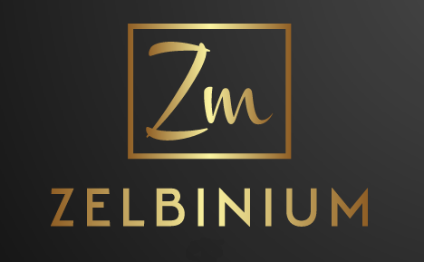

Avec *Zelbinium*, il est facile de créer des programmes avec une véritable [interface graphique](https://fr.wikipedia.org/wiki/Interface_graphique) et de les partager avec ses amis afin qu'ils puissent les utiliser avec leurs propres appareils (ordinateur personnel, smartphone, tablette…).

Voici à quoi ressemble le jeu [Othello](https://fr.wikipedia.org/wiki/Othello_(jeu)) tel que présent sur *Zelbinium* :

Sur ce site on trouvera encore plein d'autres programmes, mais également comment les utiliser, les modifier et en créer de nouveaux juste en utilisant un navigateur web, tel que celui utilisé pour accéder à ce site, sans avoir rien à installer, et ce même sur smartphone et sur tablette. Tout cela est indiqué dans la section [*Action !*](./action/) de ce site.